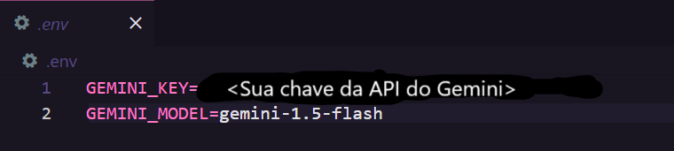
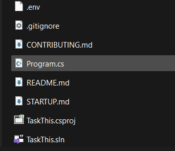
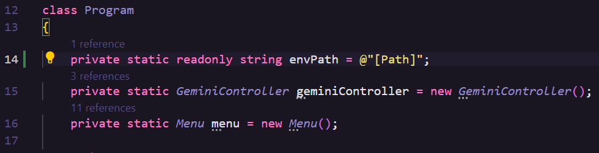

# Esse processo precisa acontecer apenas uma vez!
Para a aplicação funcionar, é necessário que algumas configurações sejam feitas. Siga os seguintes passos:

1. Clone esse repositório para sua máquina:
```bash
git clone https://github.com/AlexandreDantasz/TaskThis
```
2. Crie um arquivo ".env" dentro da pasta TaskThis gerada após o comando anterior.
3. Crie uma chave para a API do Google Gemini [aqui](https://aistudio.google.com/app/apikey) e copie ela.
4. Escreva o seguinte texto dentro do arquivo .env e cole sua chave no lugar de "SUA CHAVE DA API do Gemini" 
5. Copie o caminho absoluto do arquivo .env na sua máquina.
6. Abra o arquivo Program.cs. 
<br><br>  
7. Substitua [Path] pelo caminho absoluto que você copiou e salve o arquivo!
<br><br>  